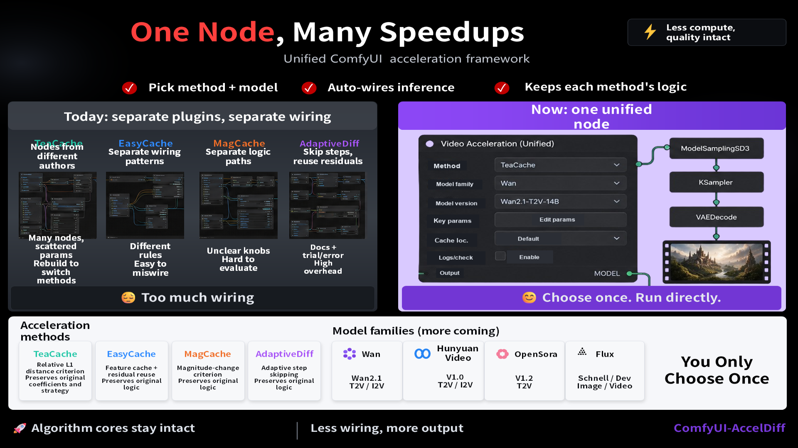

# ComfyUI-AccelDiff

A unified ComfyUI custom node for **training-free diffusion acceleration**. This node integrates multiple acceleration methods — including both **sampler-level** (model output reuse/approximation) and **model-level** (attention/layer feature caching) approaches — into a single, easy-to-use node. Users can select different acceleration strategies without needing a separate node for each method.




[Download the English promotional slide deck](docs/ComfyUI-AccelDiff_Promo_EN.pptx)

---

## 📖 Introduction

Diffusion model inference is computationally expensive. Many **training-free** acceleration methods have been proposed to speed up the sampling process without retraining the model. These methods generally fall into two categories:

- **Sampler-level methods**: Reuse or approximate the model's output (predicted noise/denoised result) across timesteps to skip redundant denoising computations.
- **Model-level methods**: Cache and reuse intermediate features (e.g., attention maps, transformer block outputs) inside the model architecture to reduce per-step computation.

**ComfyUI-AccelDiff** unifies these methods into **one single node** (`AccelDiff Unified`), allowing users to:
- Select an acceleration method from a dropdown
- Customize parameters to achieve better speed-quality trade-offs for your specific use case
- Seamlessly integrate acceleration into existing ComfyUI workflows

### Supported Methods

#### Sampler-level (step-skipping / output reuse)

| Method | Description | Docs |
|--------|-------------|------|
| **AdaptiveDiff** | Third-order latent difference guided adaptive step-skipping | [📄 Details](docs/adaptivediff.md) |
| **EasyCache** | Lightweight runtime-adaptive caching to reuse transformation vectors | [📄 Details](docs/easycache.md) |
| **SADA** | Stability-guided adaptive acceleration with Lagrange interpolation | [📄 Details](docs/sada.md) |
| **ZEUS** | Second-order predictor with interleaved skipping scheme | [📄 Details](docs/zeus.md) |

#### Model-level (feature caching / layer skipping)

| Method | Description | Docs |
|--------|-------------|------|
| **TeaCache** | Timestep-embedding-aware input modulation for output caching | [📄 Details](docs/teacache.md) |
| **MagCache** | Magnitude-law-based adaptive timestep skipping with single-sample calibration | [📄 Details](docs/magcache.md) |
| **TaylorSeer** | Taylor series expansion for predicting future timestep features | [📄 Details](docs/taylorseer.md) |
| **HiCache** | Hermite polynomial-based feature cache with dual-scaling mechanism | [📄 Details](docs/hicache.md) |
| **SeaCache** | Spectral-evolution-aware cache with SEA filter for dynamic scheduling | [📄 Details](docs/seacache.md) |

---

## 🆕 Updates

- **[2025-06]** Added **SADA**, **ZEUS**, **TaylorSeer**, **HiCache**, and **SeaCache** methods.
- **[2025-06]** 🎉 Initial release with support for **AdaptiveDiff**, **EasyCache**, **TeaCache**, and **MagCache**.

---

## 🔧 Installation

### Method 1: ComfyUI Manager (Recommended)

Search for `ComfyUI-AccelDiff` in ComfyUI Manager and install directly.

### Method 2: Manual Installation

1. Navigate to your ComfyUI custom nodes directory:

```bash
cd ComfyUI/custom_nodes/
```

2. Clone this repository:

```bash
git clone https://github.com/YOUR_USERNAME/ComfyUI-AccelDiff.git
```

3. Install dependencies:

```bash
cd ComfyUI-AccelDiff
pip install -r requirements.txt
```

4. Restart ComfyUI.

### Requirements

- ComfyUI (latest version recommended)
- Python >= 3.10
- PyTorch >= 2.1.0
- See `requirements.txt` for full dependencies

---

## 🚀 Usage

### Finding the Node

The node is located at: **AccelDiff** → `AccelDiff Unified`

### How It Works

1. **Select acceleration methods** from the `sampler_method` and `model_method` dropdowns (can be used independently or together).
2. The node UI **dynamically updates** to show only the relevant parameters and I/O slots:
   - **Sampler-type methods** (AdaptiveDiff, EasyCache, SADA, ZEUS): Output a `SAMPLER` — connect it to your KSampler node's sampler input.
   - **Model-type methods** (TeaCache, MagCache, TaylorSeer, HiCache, SeaCache): Accept a `MODEL` input and output an accelerated `MODEL` — insert it between your model loader and KSampler.
   - When set to "None", the corresponding output slot is hidden automatically.
   - Both methods can be enabled simultaneously for combined acceleration.
3. **Configure parameters** according to your quality/speed trade-off preferences.

### Workflow Examples

#### Sampler-only (AdaptiveDiff / EasyCache / ZEUS)

```
[AccelDiff Unified (sampler_method=XXX)] --sampler--> [KSampler]
```

#### Model-only (TeaCache / MagCache / TaylorSeer / HiCache / SeaCache)

```
[Model Loader] --model--> [AccelDiff Unified (model_method=XXX)] --model--> [KSampler]
```

#### Sampler + Model combined

```
[Model Loader] --model--> [AccelDiff Unified (sampler_method=XXX, model_method=YYY)] --sampler--> [KSampler]
                                                                                      --model--> [KSampler]
```

---

## 📋 Parameters Reference

Each method has its own detailed documentation with full parameter tables, tuning guides, and citations. Click the links below:

#### Sampler Methods

- [AdaptiveDiff](docs/adaptivediff.md) — Third-order latent difference guided step-skipping
- [EasyCache](docs/easycache.md) — Runtime-adaptive transformation vector caching
- [SADA](docs/sada.md) — Stability-guided adaptive acceleration with Lagrange interpolation
- [ZEUS](docs/zeus.md) — Second-order predictor with interleaved skipping

#### Model Methods

- [TeaCache](docs/teacache.md) — Timestep-embedding-aware input modulation for caching
- [MagCache](docs/magcache.md) — Magnitude-law-based adaptive timestep skipping
- [TaylorSeer](docs/taylorseer.md) — Taylor series expansion feature prediction
- [HiCache](docs/hicache.md) — Hermite polynomial-based feature cache with dual-scaling
- [SeaCache](docs/seacache.md) — Spectral-evolution-aware dynamic cache scheduling

---

## 🏗️ Project Structure

```
ComfyUI-AccelDiff/
├── __init__.py              # Node registration
├── nodes.py                 # Main node logic with dynamic UI
├── js/
│   └── mine.js              # Frontend JS for dynamic widget show/hide
├── sampler/
│   ├── adaptivediff.py      # AdaptiveDiff sampler implementation
│   ├── easycache.py         # EasyCache sampler implementation
│   ├── sada.py              # SADA sampler implementation
│   └── zeus.py              # ZEUS sampler implementation
├── model/
│   ├── teacache/            # TeaCache model-level acceleration
│   ├── magcache/            # MagCache model-level acceleration
│   ├── taylorseer/          # TaylorSeer model-level acceleration
│   ├── hicache/             # HiCache model-level acceleration
│   └── seacache/            # SeaCache model-level acceleration
├── docs/                    # Per-method detailed documentation
│   ├── adaptivediff.md
│   ├── easycache.md
│   ├── sada.md
│   ├── zeus.md
│   ├── teacache.md
│   ├── magcache.md
│   ├── taylorseer.md
│   ├── hicache.md
│   └── seacache.md
├── requirements.txt
├── LICENSE
└── README.md
```

---

## 🤝 Contributing

Contributions are welcome! If you'd like to add a new acceleration method:

1. Fork this repository
2. Choose the appropriate category:
   - Sampler-level → add implementation in `sampler/`
   - Model-level → add a new directory in `model/`
3. Register parameters in `MODEL_PARAMS` (in `nodes.py`) and `MODEL_CONFIG` (in `js/mine.js`)
4. Submit a Pull Request

---

## 📄 License

This project is licensed under the Apache License 2.0 — see the [LICENSE](LICENSE) file for details.

---

## 🙏 Acknowledgments

- [ComfyUI](https://github.com/comfyanonymous/ComfyUI) — The powerful and modular diffusion UI framework
- [AdaptiveDiff](https://github.com/InternScience/AdaptiveDiffusion) — Third-order latent difference guided adaptive step-skipping
- [EasyCache](https://github.com/EasyCacheTeam/EasyCache) — Lightweight runtime-adaptive caching for diffusion sampling
- [SADA](https://github.com/SADA-Diffusion/SADA) — Stability-guided adaptive diffusion acceleration
- [ZEUS](https://github.com/ZEUS-Diffusion/ZEUS) — Second-order predictor with interleaved skipping scheme
- [TeaCache](https://github.com/ali-vilab/TeaCache) — Timestep embedding aware cache for training-free acceleration
- [MagCache](https://github.com/Zehong-Ma/MagCache) — Magnitude-aware cache with single-sample calibration
- [TaylorSeer](https://github.com/Shenyi-Z/TaylorSeer) — Taylor series expansion for future timestep feature prediction
- [HiCache](https://github.com/HiCache-Diffusion/HiCache) — Hermite polynomial-based feature cache with dual-scaling
- [SeaCache](https://github.com/SeaCache/SeaCache) — Spectral-evolution-aware cache for dynamic scheduling

---

## ⭐ Star History

If this project helps your workflow, please consider giving it a ⭐!
